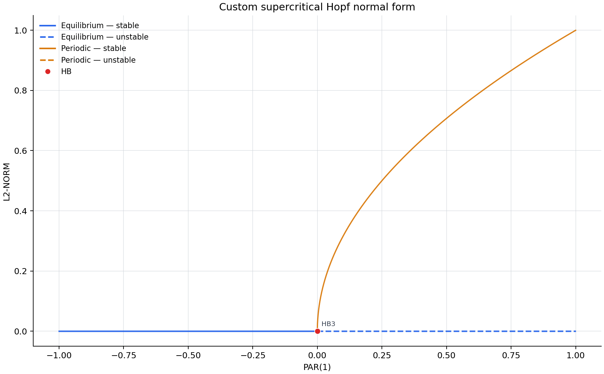

# AUTO-07p for Codex

This repository provides a Codex skill that installs and uses a pinned copy of
[AUTO-07p](https://github.com/auto-07p/auto-07p) inside a project without
modifying global shell configuration.

The intended interface is conversation with Codex. Most users should not need
to run Python helpers, source AUTO environment files, or interpret raw AUTO
output by hand.

AUTO-07p itself is not distributed by this repository. The installer retrieves
it from its official repository and records the exact source commit and local
toolchain in `.auto/install-manifest.json`.

It gives Codex a repeatable workflow to:

- inspect the local compiler and Python environment;
- install a pinned AUTO-07p source revision inside the current project;
- verify the installation with a real continuation calculation;
- run equilibrium and periodic-orbit continuation; and
- render branch data as PNG, SVG, tidy CSV, and JSON.



## Install the skill in Codex

You do not need to clone this repository to use the skill.

1. Create an empty project folder and open it as a new project in Codex.
2. Give Codex this repository URL and ask it to follow the repository
   instructions:

   > Read this repository and install the Codex skill it provides:
   > https://github.com/dueyama/auto-07p-codex

   Codex should inspect the repository and install
   `skills/analyze-bifurcations-with-auto/`. If it asks for the exact skill
   directory, provide:

   > https://github.com/dueyama/auto-07p-codex/tree/main/skills/analyze-bifurcations-with-auto

3. After Codex reports that the skill was installed, send a new message:

   > Use the `analyze-bifurcations-with-auto` skill. Check the dependencies,
   > install AUTO-07p inside this project, and verify the installation.

   Codex will inspect the toolchain first and ask before installing a missing
   system package such as Homebrew `gcc`.

4. Run the bundled demonstration:

   > Run AUTO-07p's `ab` demo and show me the bifurcation diagram.

The installed skill becomes available on the next Codex turn. It is copied to
`$CODEX_HOME/skills/analyze-bifurcations-with-auto/`; AUTO itself is then built
separately inside the current project's `.auto/` directory.
Install the skill only once per Codex environment. For later analysis projects,
skip step 2 and ask Codex to use the already installed skill.

## What is installed where

```text
$CODEX_HOME/skills/
└── analyze-bifurcations-with-auto/   # reusable Codex skill

your-analysis-project/
├── .auto/                            # project-local AUTO-07p, ignored by Git
└── runs/                             # local calculations and plots
```

The skill does not edit `.zshrc`, `.bashrc`, or other shell startup files.
Each project can therefore use and verify its own pinned AUTO installation.

## Analyze your own model

After the demo works, give Codex your equations and describe the parameter you
want to vary. Initial values and a continuation range help when they are known,
but you can also ask Codex to propose a bounded first run.

For example:

> Here are my equations. Vary `mu`, find the bifurcations, and show me the
> bifurcation diagram.

Codex can propose AUTO settings, explain what it found, continue periodic
solutions when appropriate, and keep the model, logs, branch files, plots, and
machine-readable exports together in a dedicated run directory.

## What Codex shows

Every accepted analysis includes a bifurcation diagram displayed in Codex.
Stable segments are solid, unstable segments are dashed, equilibrium and
periodic branches are distinguished, and special points such as `HB`, `LP`,
`BP`, `PD`, and `TR` are labeled when detected. Codex also saves PNG and SVG
figures plus tidy CSV and JSON results for later use.

## Original Hopf example

`examples/custom-hopf/` is an original, analytically solvable example rather
than an AUTO demo. It continues the supercritical Hopf normal form

```text
x' = mu*x - y - x*(x^2 + y^2)
y' = x + mu*y - y*(x^2 + y^2)
```

from its equilibrium branch, detects the Hopf point at `mu = 0`, and continues
the stable periodic branch. Theory predicts radius `sqrt(mu)` and period
`2*pi` for `mu > 0`.

In the checked result, AUTO located the Hopf point at
`mu = -3.0e-9`. The maximum errors were `3.0e-9` for `radius^2 - mu`
and `2.1e-11` for the period relative to `2*pi`.

## Skill source

The repository-local skill is
[`skills/analyze-bifurcations-with-auto/`](skills/analyze-bifurcations-with-auto/).
The root `AGENTS.md` tells Codex when to use it while developing this
repository. End users install the skill directory into their Codex skills
directory using the GitHub URL above.

## Supported environments

The current implementation has been tested only on Apple silicon macOS.

Linux is expected to work with Python 3, Git, GNU Make, a C compiler, and
`gfortran`, but it has not yet been verified by this project. Native Windows
has not been tested or designed as a supported environment; WSL is the
recommended route and is also currently unverified.

On macOS, Homebrew supplies `gfortran` through its `gcc` formula. Codex checks
for it and asks for approval before installing a missing system package.

The installer uses the first `gfortran` on `PATH`, performs a compile-and-link
probe before building AUTO, and records the resolved compiler path and version
in `.auto/install-manifest.json`.

Verified on Apple silicon macOS:

| Fortran compiler | AUTO build | Official `ab` verification | Original Hopf example and plots |
| --- | --- | --- | --- |
| Homebrew GCC 16.1.0 | Pass | Pass | Pass |
| Standalone GCC 12.2.0 | Pass | Pass | Pass |

Expected platform status:

| Platform | Status |
| --- | --- |
| Apple silicon macOS | Verified |
| Intel macOS | Expected to work; not tested |
| Linux | Expected to work; not tested |
| Windows through WSL | Expected to work; not tested |
| Native Windows | Not supported or tested |

AUTO's optional interactive plotting tools can require additional Tk/X11
packages. Their absence does not prevent continuation calculations or
non-interactive plotting from saved branch data.

## Developer and CLI reference

The command-line helpers are implementation and development tools, not the
primary user interface. Contributors working in a checkout can run:

```bash
python3 scripts/autoctl.py doctor
python3 scripts/autoctl.py install
python3 scripts/autoctl.py verify
```

`verify` runs AUTO's official `ab` demo and requires actual Hopf and limit
points in the generated output. `scripts/plot_bifurcation.py` is the
non-interactive renderer used by the skill. The `bin/auto-codex` wrapper loads
AUTO's environment for one child process without changing shell startup files.

## License boundary

The integration code in this repository is MIT-licensed. AUTO-07p is a
separate upstream project with its own authorship and distribution terms.
